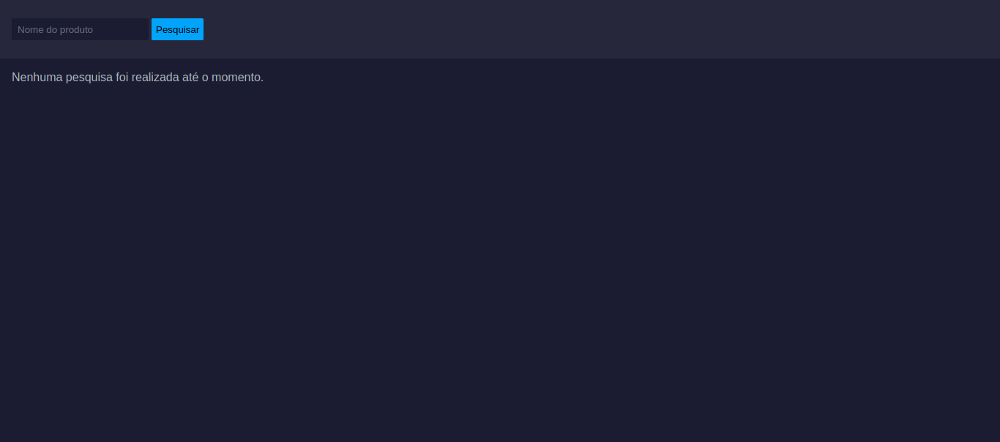
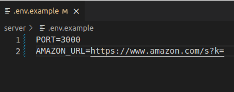
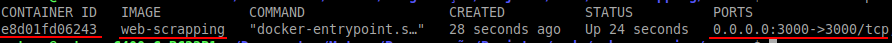
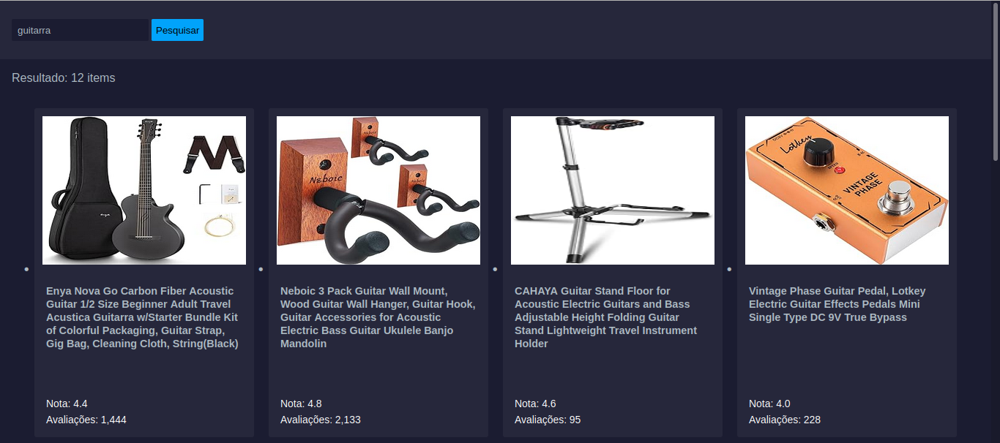

# products-api-nodejs

## Tabela de Conteúdo
- [Overview](#overview)
  - [Screenshot](#screenshot) 
- [Documentação](#documentação)
  - [Instalação](#instalação)
  - [Rotas](#rotas)
    - [Scraper](#scraper)

## Overview

Realiza extração de dados dos produtos encontrados no site da Amazon. A extração de dados é disponibilizada por meio de uma API Rest utilizando Node.js, na qual é consumida por uma página HTML atráves de uma requisição ajax utilizando fetch. Os dados retornados são exibidos nessa página HTML.

Um resumo do projeto:
<ul>
  <li>Realizar uma requisição HTTP através da rota de uma API utilizando o método GET</li>
  <li>Extração de dados em Node.js utilizando a biblioteca Cheerio</li>
  <li>Dados extraídos são retornados como resposta no formato JSON após passar uma palavra-chave</li>
  <li>Utilização de .ENV para ocultação de dados sensíveis ou da URL cujos dados serão extraídos</li>
  <li>Utilização do design pattern Strategy para:
  <ul>
    <li>Melhor organização do código</li>
    <li>Manutenção, adições de novas funcionalidades ou diferentes algoritimos para extração de dados</li>
    <li>Baixo acoplamento</li>
  </ul>
  </li>
  <li>Utilização de docker para a portabilidade em diferentes ambientes</li>
  <li>
    Uma página web criada utilizando HTML, CSS e Javascript responsável por:
    <ul>
      <li>Consumir os dados do backend através de uma requisição ajax usando 'fetch'</li>
      <li>Apresentar os dados extraídos de forma amigável em uma view</li>
  </ul>
  </li>
</ul>

### Ferramentas utilizadas
<ul>
  <li>Javascript</li>
  <li>Node.js</li>
  <li>Express.js</li>
  <li>Cheerio</li>
  <li>Docker</li>
  <li>Dotenv (.env)</li>
  <li>HTML</li>
  <li>CSS</li>
  <li>NPM (Gerenciador de dependências)</li>
  <li>Nodemon (Auto reload)</li>
</ul>

## Screenshot



## Documentação

### Instalação

Após clonar o repositório, faça os passos abaixo para completar a instalação do projeto:

Entre dentro do diretório clonado do projeto, onde haverá 2 pastas, uma chamada 'client' (página HTML) e a outra chamada 'server' (API Node.js). Entre dentro da pasta 'server' e em seguida realize os passoa abaixo.

  - ./env.example - Mude o nome do arquivo para .env
    


Abra o arquivo '.env' que estará com os valores vazios. Adicione em 'PORT=' o valor 3000 e em 'AMAZON_URL=' a url 'https://www.amazon.com/s?k=', igual está na imagem acima. Sem isso o projeto não vai funcionar.

Feito isso, escolha um dos passos de instalação abaixo para continuar a configuração do projeto.

#### Docker

```
sudo docker build -t web-scrapping .
```
  Após o docker terminar de construir a imagem, execute o comando:
  
```
sudo docker run -dp 3000:3000 web-scrapping
```

Se configurado conforme os passos mostrados e tudo ocorrer conforme o planejado, então a API está pronta.
Ao utilizar o comando abaixo, o seguinte resultado deve aparecer:

```
sudo docker ps
```


#### Javascript

Instale as dependencias necessárias com o comando abaixo:

```javascript
npm install
```

Execute o comando a seguir para iniciar a API

```javascript
npm start
```
Ou

```javascript
node server.js
```
### Uso

Abra a pasta 'client' presente dentro do diretório clonado do projeto e abra o arquivo 'index.html'.
Digite o nome de um produto que deseja buscar e em seguida aperte enter o clique no botão.



### Rotas

Rotas existentes para essa API:

#### Scraper

| Método| Rota |Descrição|
|------|-------|---------|
| GET  |`/api/scrape`| Retorna dados em formato JSON de produtos, extraídos do site da amazon |
